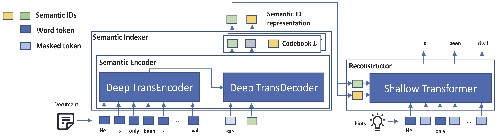
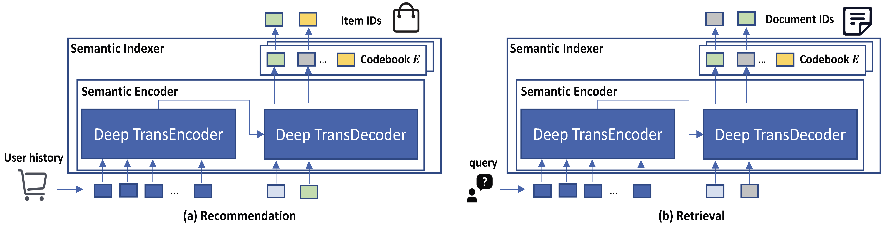

# Language Models as Semantic Indexers

This repository contains the source code and datasets for [Language Models as Semantic Indexers](https://arxiv.org/pdf/2310.07815), arxiv 2023.

## Links

- [Requirements](#requirements)
- [Overview](#overview)
- [Data Preparation](#data-preparation)
- [Learn Semantic IDs](#learn-semantic-ids)
- [Downstream Tasks](#downstream-tasks)
- [Citations](#citations)

## Requirements

The code is written in Python 3.8. Before running, you need to first install the required packages by typing following commands (Using a virtual environment is recommended):

```
pip3 install -r requirements.txt
```

## Overview
**LMIndexer** is a self-supervised framework learned to tokenize documents into semantic IDs.

<p align="center">
  
</p>

**LMIndexer** can be applied to various downstream tasks, including recommendation and retrieval.

<p align="center">
  
</p>

## Data Preparation
**Download processed data.** To reproduce the results in our paper, you need to first download the processed [datasets](https://drive.google.com/drive/folders/1sFZ583qOmOVBg4RGKFhgvk7zNM-Sjtr2?usp=sharing). Then put the dataset folders under ```data/rec-data/{data_name}``` (data_name=Beauty, Sports, Toys) and ```data/retrieval-data/{data_name}``` (data_name=NQ_aug, macro) respectively.

**Raw data & data processing.** Raw data can be downloaded from [Amazon-Recommendation](https://cseweb.ucsd.edu/~jmcauley/datasets/amazon/links.html), [Amazon-Retrieval](https://github.com/amazon-science/esci-data), [NQ](https://drive.google.com/drive/folders/1AcGozhgI679j9ybxL7iCi2iMHipIlHnY?usp=drive_link) and [MS-MACRO](https://drive.google.com/drive/folders/1WQTp7caUyQZXWwoVu2_Tj5NJ56pPsRVj?usp=drive_link) directly. More details about the data processing for recommendation, product retrieval and document retrieval can be found [here](https://github.com/PeterGriffinJin/LMIndexer/tree/main/data).

## Learn Semantic IDs

Codes are in ```SemanticID/```. Please refer to the ```README.md``` [here](https://github.com/PeterGriffinJin/LMIndexer/tree/main/SemanticID).

## Downstream Tasks
Codes are in ```downstream/```. Please refer to the ```README.md``` [here](https://github.com/PeterGriffinJin/LMIndexer/tree/main/downstream).


## Citations

Please cite the following paper if you find the code helpful for your research.
```
@article{jin2023language,
  title={Language Models As Semantic Indexers},
  author={Jin, Bowen and Zeng, Hansi and Wang, Guoyin and Chen, Xiusi and Wei, Tianxin and Li, Ruirui and Wang, Zhengyang and Li, Zheng and Li, Yang and Lu, Hanqing and others},
  journal={arXiv preprint arXiv:2310.07815},
  year={2023}
}
```
