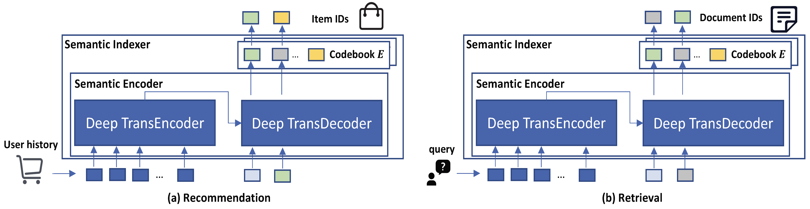

# Pipeline for apply LMIndexer on downstream tasks

## Overview
**LMIndexer** can be applied to various downstream tasks, including recommendation and retrieval.

<p align="center">
  
</p>

## Sequential recommendation (Amazon)

Train our model.
```
bash run_ours_rec.sh
```

Test our model
```
bash test_rec.sh
```

## Product search (Amazon)

Train our model.
```
bash run_ours_retrieval.sh
```

Test our model
```
bash test_product_retrieval.sh
```

## Document retrieval (NQ)

Train our model.
```
bash run_ours_retrieval_nq.sh
```

Test our model
```
bash test_nq.sh
```

## Document retrieval (MACRO)

Train our model.
```
bash run_ours_retrieval_macro.sh
```

Test our model
```
bash test_macro.sh
bash test_trec.sh
```
